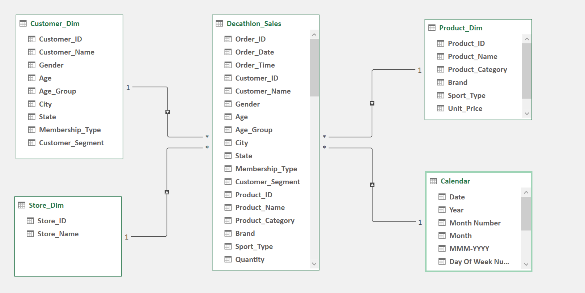

# Decathlon India Sales Performance Dashboard - Excel Portfolio Project

# Project Objective
An interactive Excel dashboard built with Power Pivot, DAX, PivotTables and PivotCharts to analyze Decathlon's sales, customer behavior and retail performance. The dashboard provides executive-level insights through KPI tracking, customer analytics, store performance and actionable business recommendations.
# Dashboard Preview

# Dashboard Demo

# Business Problem
In this portfolio case study, I assumed the role of a Business Analyst to address a common retail reporting challenge. The objective was to create a centralized dashboard that consolidates sales, customer and retail operations data into a single reporting solution.

Without a unified dashboard, it can be difficult to track business performance, identify sales trends, understand customer behavior, compare store performance and monitor product returns. This project demonstrates how interactive reporting can help stakeholders gain actionable insights and support data-driven decision-making.

# Solution
To solve this challenge, I developed an interactive Excel dashboard using **Power Pivot**, **DAX**, **PivotTables**, and **PivotCharts**. The dashboard brings all key business metrics into one centralized reporting solution, allowing stakeholders to track sales performance, understand customer demographics, evaluate retail operations, measure campaign effectiveness, monitor product returns and uncover actionable insights through interactive filters and dynamic visualizations. This enables faster, data-driven decision-making with a clear view of overall business performance.

# Dashboard Objectives
★ Analyze sales, profit, and key business KPIs over time. 
★ Understand customer demographics and buying behavior. 
★ Evaluate store performance, marketing campaigns, and product returns. 
★ Enable stakeholders to explore data using interactive filters and visualizations. 
★ Support faster, data-driven business decisions with actionable insights.

# Dashboard Features
<h3>KPI cards</h3>
<ul>
  <li>Total Sales</li>
  <li>Total Orders</li>
  <li>Total Profit</li>
  <li>Average Order Value (AOV)</li>
  <li>Profit Margin %</li>
  <li>Total Customers</li>
  <li>Average Rating</li>
  <li>Average Money spend</li>
  <li>Premium member sales</li>
  <li>Retention rate</li>
  <li>Total Stores</li>
  <li>Total Products</li>
  <li>Products sold</li>
  <li>Returned orders</li>
  <li>Return rate %</li>
</ul>
<h4>Interactive Filters</h4>
<ul>
  <li>Platform</li>
  <li>Year</li>
  <li>Quarter</li>
  <li>Membership</li>
  <li>Customer segment</li>
  <li>Payment mode</li>
  <li>Delivery type</li>
  <li>Age group</li>
  <li>Gender</li>
</ul>
<h4>Visualization</h4>
<ul>
  <li>Monthly Sales vs Target</li>
  <li>Profit by Sport category</li>
  <li>Total sales and Total orders for top 5 Sports type</li>
  <li>Sales by State</li>
  <li>Sales by Gender</li>
  <li>Sales contribution by Age group</li>
  <li>Retention Analysis</li>
  <li>Top 5 customers</li>
  <li>Return reason analysis for Top 5 Product categories</li>
  <li>Store wise Sales Analysis</li>
  <li>Promotion Campaign Performance</li>
</ul>

# Project Workflow
<h4>Step 1: Data Collection</h4>
Downloaded Decathlon Sales dataset from Kaggle. Explored the dataset to understand the structure, business attributes and available metrics.
<h4>Step 2: Data Preparation and Cleaning</h4>
The dataset was uploaded to Power Query editor in Excel and necessary cleaning and formatting like checking for missing values and other inconsistencies in data was done. A calendar table was created using Power Pivot to apply DAX Time Intelligence functions.
<h4>Step 3: Data Modelling</h4>
The dataset initially had only one transactional (fact) table. To build a proper data model using Star Schema, I created separate dimension tables for Customer, Store, Product and Calendar from the existing data. After creating the dimension tables, I established relationships between the fact table and each dimension table. This made the data model more organized and supported efficient analysis, filtering and DAX calculations.

 
<h4>Step 4: Created DAX Measures</h4>
Created DAX measures in Power Pivot to calculate key business metrics.
<h4>Step 5: Data Analysis</h4>
Analyze sales, profit, customer behavior, store performance, campaign performance and product returns using PivotTables and DAX measures.
<h4>Step 6: Dashboard Development</h4>
Built multiple interactive dashboard pages using PivotTables, PivotCharts, KPI cards and slicers. Designed a consistent layout, navigation and color theme to provide a clean, user-friendly and executive-style reporting experience.
<h4>Step 7: Generated Insights & Recommendations</h4>
Analyzed each dashboard page to identify key business insights and translated the findings into actionable recommendations.

# Tools and Technologies used
<ol>
  <li>Microosft Excel</li>
  <li>Power Query</li>
  <li>Data Modelling</li>
  <li>Data Cleaning</li>
  <li>DAX (Data Analysis Expressions) </li>
  <li>Data Analysis</li>
  <li>Data Visualization</li>
  <li>Figma - Dashboard inspiration</li>
</ol>

  <h2>Connect with Me</h2>

