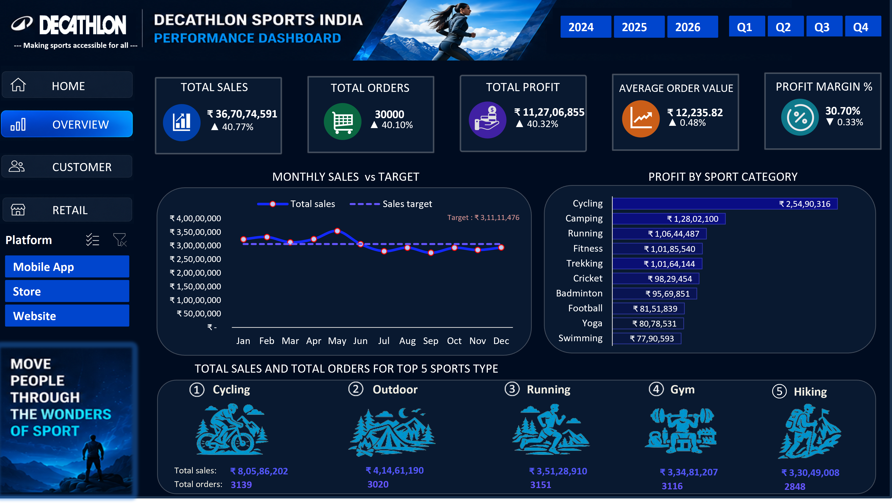
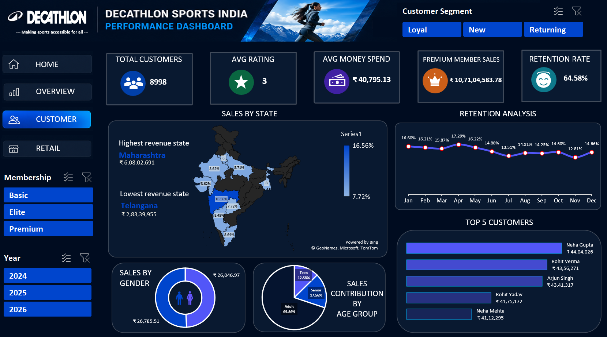
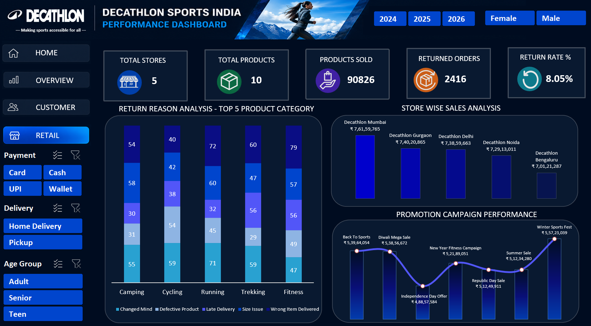
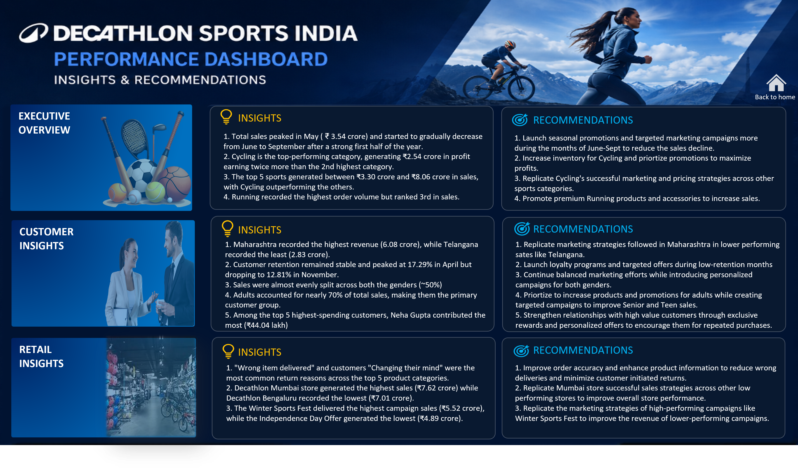

# Decathlon India Sales Performance Dashboard - Excel Portfolio Project

# Project Objective
An interactive Excel dashboard built with Power Pivot, DAX, PivotTables and PivotCharts to analyze Decathlon's sales, customer behavior and retail performance. The dashboard provides executive-level insights through KPI tracking, customer analytics, store performance and actionable business recommendations.
# Dashboard Preview

 
  <h4>🤔Business Problem</h4>
Decathlon's management lacked a centralized reporting solution to monitor sales performance, customer insights, retail operations and product returns. The objective was to create an interactive dashboard that supports data-driven decision-making across multiple business functions.

